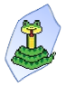
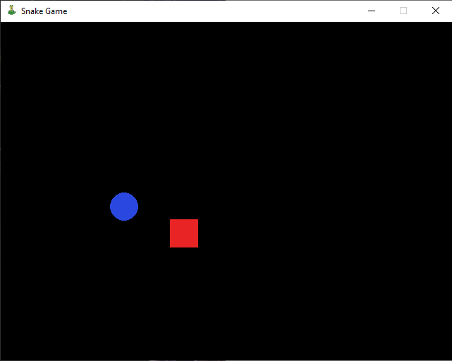

# Snake Game </a>
<!-- badges: start -->

<!-- badges: end -->

## Overview

It's my first game building in python language.\
To do that, I used *pygame*, *exit* and *randint* in the *PyCharm Community Edition* IDE.

At the moment, it's like that: 

</a>

To see all code, acess [Snake_game.py](https://github.com/felipe179971/Snake_Game/blob/master/Snake_game.py).
